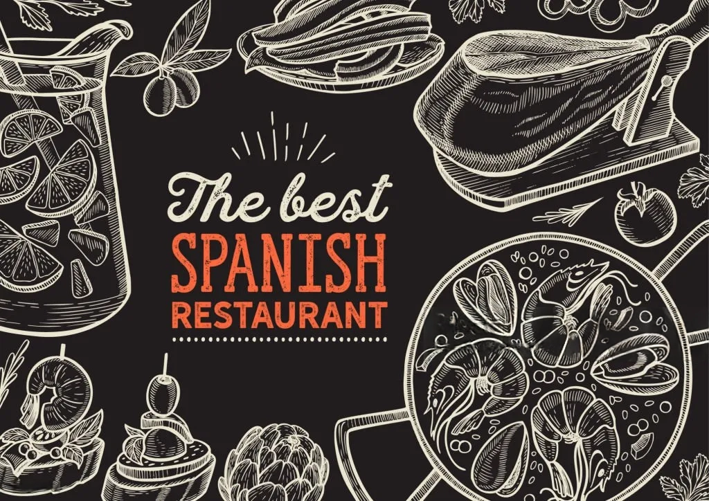
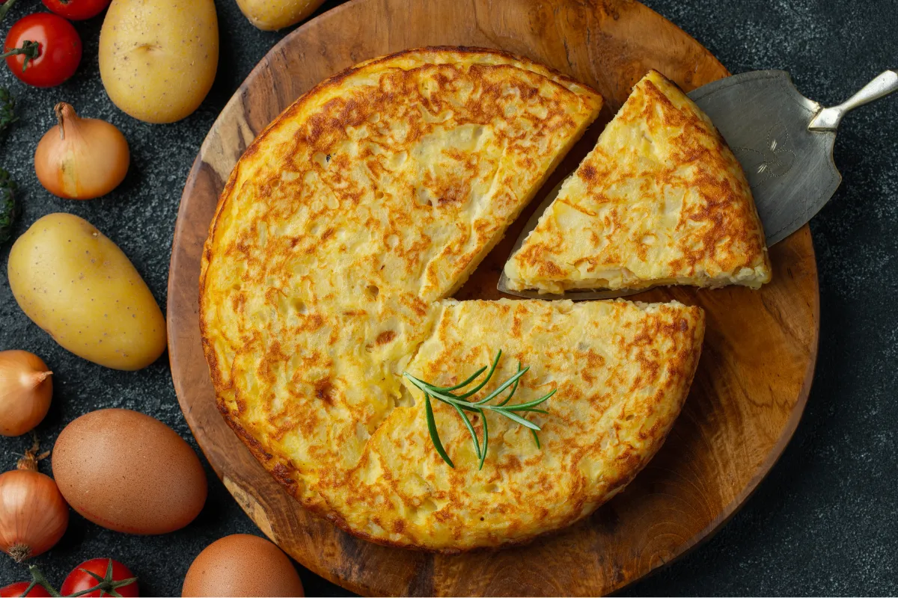
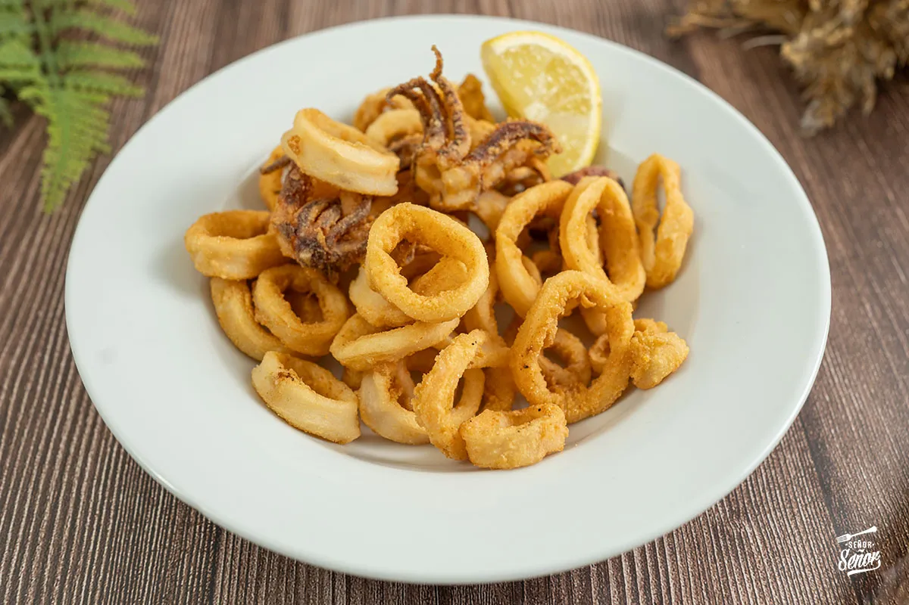
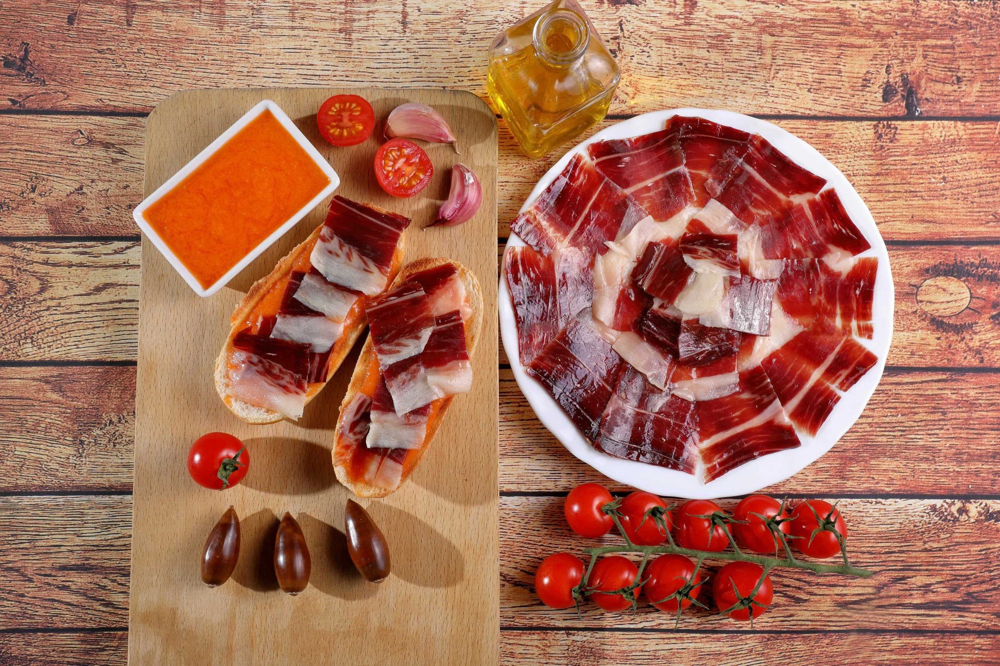
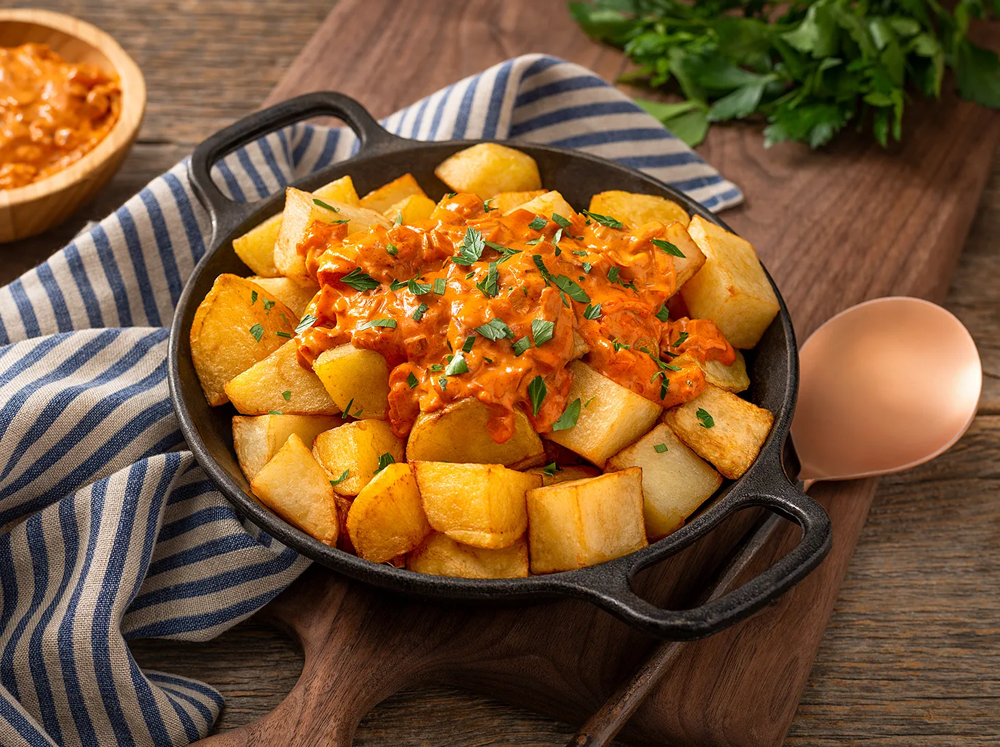
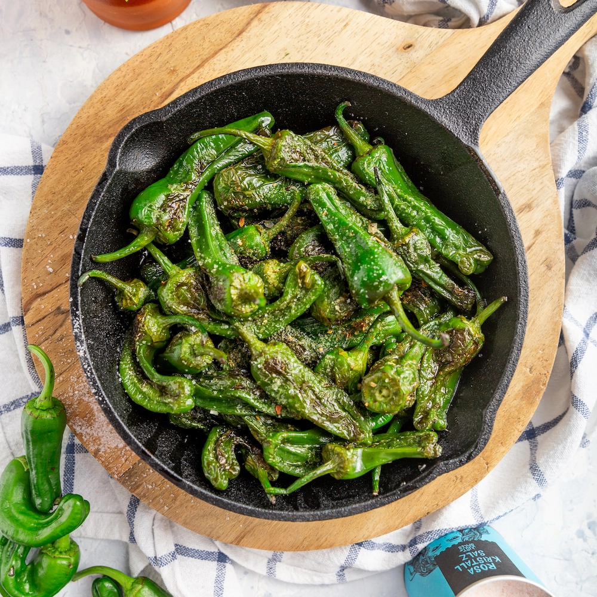
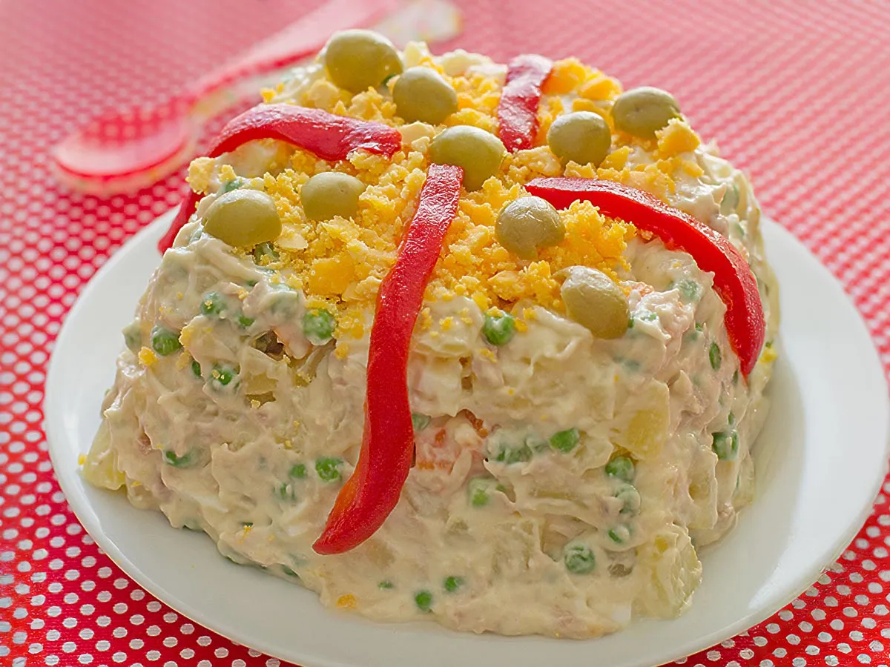

<!DOCTYPE html>
<html lang="es">
<head>
  <meta charset="UTF-8">
  <meta name="viewport" content="width=device-width, initial-scale=1.0">
  <title>Bar de Tapas</title>
  <link rel="stylesheet" href="css/style.css">
</head>
<body>
  

    <header>
      <h1>Bienvenido al Bar de Tapas</h1>
      
El mejor sabor de España en cada bocado

      
    </header>

    <main>
      <h2>Nuestras Tapas</h2>
      

        <!-- Tarjeta 1 -->
        

          
          <h3>Tortilla Española</h3>
          
<strong>Ingredientes:</strong> patatas, huevos, aceite de oliva (cebolla opcional)

          
<strong>Precio:</strong> 10.00 €

          <button onclick="alert('Has comprado: Tortilla Española')">Ver Detalles</button>
        

        <!-- Tarjeta 2 -->
        

          
          <h3>Calamares</h3>
          
<strong>Ingredientes:</strong> calamares, harina, huevo, sal

          
<strong>Precio:</strong> 8.00 €

          <button onclick="alert('Has comprado: Calamares')">Ver Detalles</button>
        

        

        <!-- Tarjeta 3 -->
        

          
          <h3>Jamón ibérico</h3>
          
<strong>Ingredientes:</strong> jamón, pimientos de padrón, aceite de oliva

          
<strong>Precio:</strong> 7.00 €

          <button onclick="alert('Has comprado: Jamón ibérico')">Ver Detalles</button>
        

        <!-- Tarjeta 4 -->
        

          
          <h3>Patatas bravas</h3>
          
<strong>Ingredientes:</strong> patatas, aceite de oliva, salsa brava

          
<strong>Precio:</strong> 10.00 €

            <button onclick="alert('Has comprado: Patatas bravas')">Ver Detalles</button>
        

        <!-- Tarjeta 5 -->
        

          
          <h3>Pimientos de padrón</h3>
          
<strong>Ingredientes:</strong> pimientos de padrón, sal, aceite de oliva

          
<strong>Precio:</strong> 3.00 €

          <button onclick="alert('Has comprado: Pimientos de padrón')">Ver Detalles</button>
        

        <!-- Tarjeta 6 -->
        

          
          <h3>Ensaladilla</h3>
          
<strong>Ingredientes:</strong> patata, zanahoria, atún, mayonesa, guisantes, huevo duro

          
<strong>Precio:</strong> 2.00 €

          <button onclick="alert('Has comprado: Tortilla Española')">Ver Detalles</button>
        

      

    </main>

    <footer>
      
© 2025 Bar de Tapas – Sabor, tradición y buena compañía.

      
¿Gracias por visitarnos? Visítanos en <a href="#">Instagram</a> y <a href="#">TikTok</a>.

    </footer>
  

  
</body>
</html>
